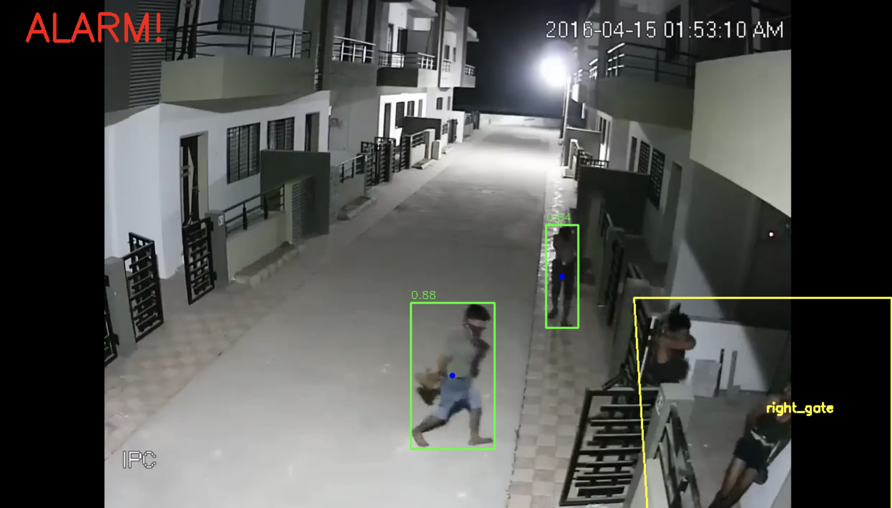
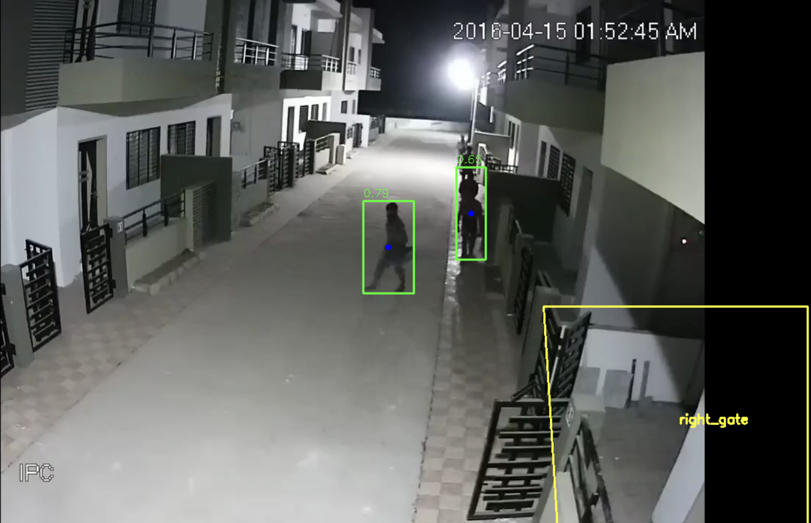
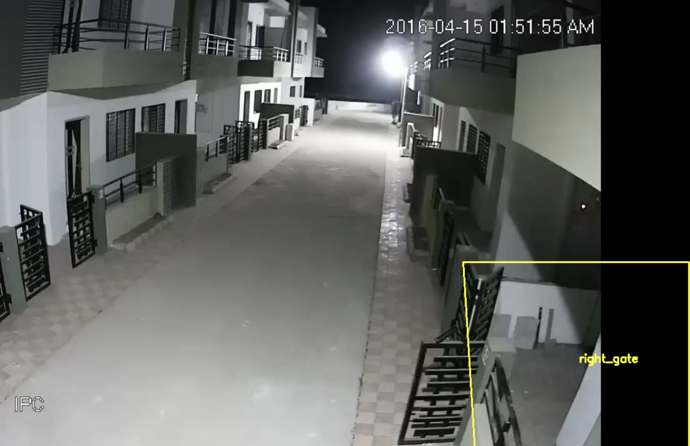

 YOLO Intrusion Detection

Система компьютерного зрения, которая определяет проникновение человека в запретную зону с использованием **YOLOv8** и **OpenCV**.


##  Установка

**Клонируй репозиторий:**
```bash
git clone https://github.com/daniyardautbaev/yolo_intrusion.git
cd yolo_intrusion
```
Установи зависимости:
```bash
pip install -r requirements.txt
```
Запуск

```bash
python3 src/main.py
```

Как работает система
Модель YOLOv8 обнаруживает людей на видео.
Центр нижней точки каждого бокса проверяется на попадание в зону.
Если человек пересекает границу — на экране появляется надпись ALARM!.

Структура проекта
```
src/
 ├── main.py                 # Главная логика
 ├── core/detector.py        # Обнаружение людей (YOLO)
 ├── io_utils/zones_io.py    # Загрузка/сохранение зон
 ├── utils/geometry.py       # Проверка пересечения
 ├── annotate_zones.py       # Разметка зон вручную
 ├── tracker.py              # Отслеживание объектов (DeepSort)
 ├── logger.py               # Логирование событий
assets/
 └── test.mp4
restricted_zones.json
requirements.txt
```
Используемые технологии
YOLOv8 (Ultralytics) — детекция объектов
OpenCV — обработка видео
NumPy — вычисления с координатами
Python 3.10+
Подробное описание


Смотри файл [explanation.md](explanation.md)


## Пример работы системы










